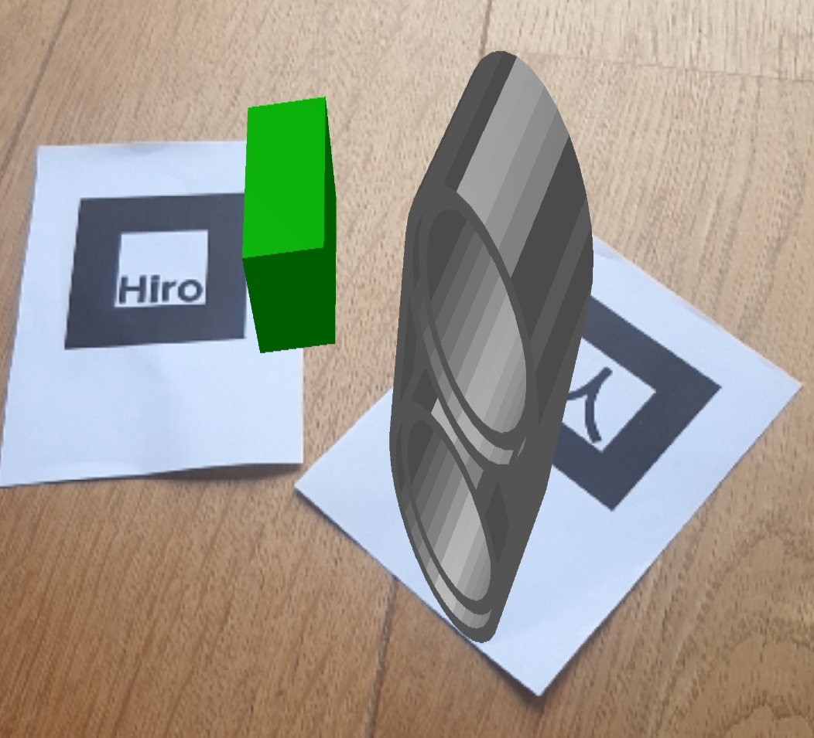

# First-Lego-League-2020-RePLAY Europagymnasium Baumgartenberg
## Forschungsprojekt:
Da der Sportunterricht am Gymnasium Coronabedingt nur aus Spaziergängen besteht, haben wir uns eine alternative Lösung überlegt. Mit opischen Tags zum Einscannen (Smartphone) werden Sportübungen in Argumented Reality angezeigt. Diese Tags werden zum Beispiel an Bäumen oder Parkbänken angebracht. Die Sportübungen sind Videos in AR, welche dann direkt am Gegenstand angezeigt werden. Unser Ziel ist es, eine Abwechslung zu den Spaziergängen zu generieren und die Schüler fit zu halten.

